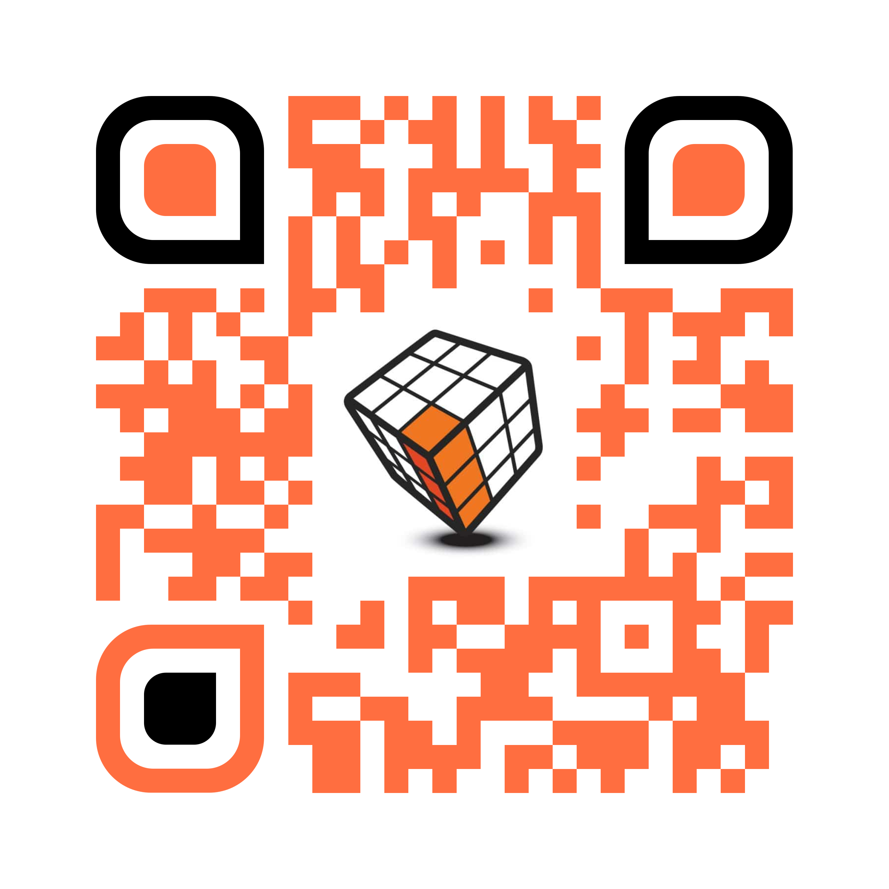
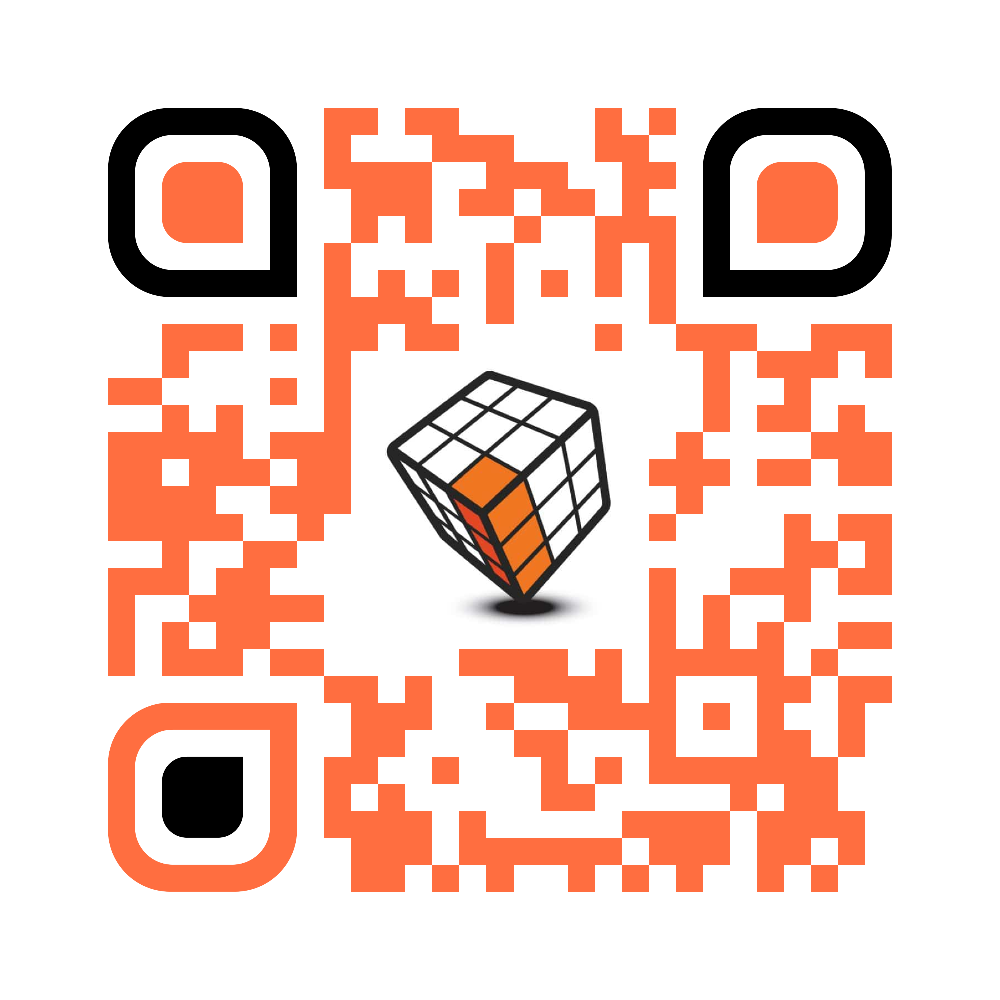

## Welcome to... [Shoot The Moon]!

Shoot The Moon is a... game(?) that is generously provided by Kelly at the Brookfield, WI Accelogix office. The goal is to earn the best composite score possible with a maximum of five tries.
This website is a preview of the functionality to come. Not everything you see here is finalized. Please contact Kevin if you have any questions/suggestions.

## Game Rules

- Each player gets 5 tries per day to build the largest composite score.
- Only the first 5 tries will be scored. (This is to prevent players from warming up).
- If a player forfeits any of their 5 turns, they incur a -250 point penalty for that turn.
- If the ball doesn't land in any bucket, a score of 0 points will be awarded for that turn.
- All scores must be witnessed by another (participating) competitor to be counted.

## Daily Results - Updated 12/14/2018

### See the winner!
<object height="335" width="650" data="graphs/12142018/12142018-pie.html"> 
    Your browser doesn’t support the object tag. 
</object>

### Compare scores on each turn!
<object height="335" width="650" data="graphs/12142018/12142018-bar.html"> 
    Your browser doesn’t support the object tag. 
</object>

### Track individual performance!
<object height="335" width="650" data="graphs/12142018/12142018-box.html"> 
    Your browser doesn’t support the object tag. 
</object>

## Looking for Links?

### Here's a link to this page.
 

### Here's a link to the historical data.
 